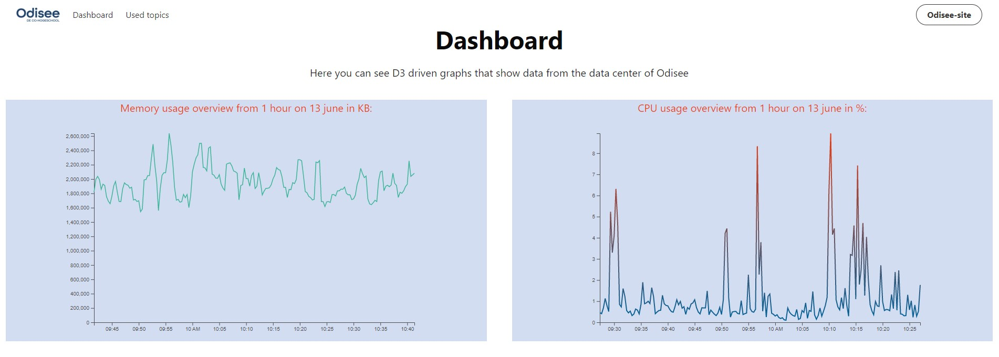

# D3.js-project

Dashboard made with D3.js
> Project to show visualized and interactive data from vSphere with D3.js and with the help of the Bulma framework.

This is an Open Source project using the GNU GPLv3 license. The GNU GPLv3 lets people do almost anything they want with a project, except distributing closed source versions.
**examples:**
Ansible, Bash, and GIMP.

## Run this project locally

Download or clone the project to your computer

**If you have Visual Studio Code:**
1. Open Visual Studio Code
2. Click on the left on extensions or press ctrl+shift+x
3. Search for Live Server
4. Install extension
5. Open the project folder
6. Click on the Live Server icon at the bottom right of Visual Studio Code

**If you have Google Chrome:**
1. Surf to https://chrome.google.com/webstore/detail/web-server-for-chrome/ofhbbkphhbklhfoeikjpcbhemlocgigb?hl=en
2. Install the extension
3. Launch the extension
4. Choose the folder where your project is located
5. Launch the local web server

## Link to project

Link to project: https://d3-js-project.pages.dev/

### Extra info

In the folder `Scripts` you can find a way to connect with the vSphere API, the connecting works for me sadly i couldnt subtract any data, my knowledge in programming is too little.

### Contact

You can contact me for question at thomas.vanhaute@gmail.com

### Sources

1. D3.js: https://d3js.org/ 
2. vSphere API: https://developer.vmware.com/apis/vsphere-automation/latest/vcenter/ 
3. Bulma: https://bulma.io/
